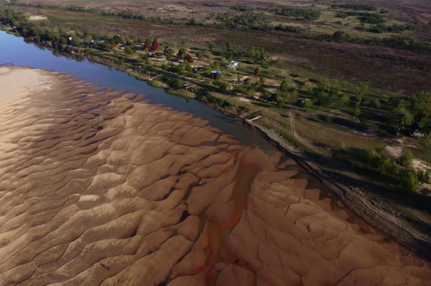

# Diapositivas

.center[]  

.center[[nmorandeira.github.io/LatinR2021](https://nmorandeira.github.io/LatinR2021)]

---

class: chapter-slide

# Un cuento digital y situado

---

# Disparador
.pull-left[
- Convocatoria de un concurso de **cuento digital**, con un plazo definido.
- Aprovechando el impulso del mundo R, ¿se puede hacer un cuento digital en este lenguaje?
- ¿Mi historia tiene un componente espacial?]

.pull-right[
.center[]  

.right[.tiny[Ilustración de [Martina López Brazzola](https://www.instagram.com/martinailustra)]]]


---

# Disparador
- Algunos apuntes en papel, un borrador del relato.

.center[]  


---

# Identidad y universo personal
.pull-left[
- Como escritora, en mi **universo personal** (_Mauricio Kartun_) están los paisajes, el campo, los humedales.]

.pull-right[
.center[] 

.right[.tiny[Fotografía tomada en el A° Saladillo Dulce, Santa Fe]]]

---
# Identidad y universo personal
.pull-left[
- La **bajante del río Paraná**: un año de pandemia estudiando incendios en el Delta. Y al visitar en 2021 encuentro otra cara de la bajante: los _detectores de metales_ en la costa de ríos y lagunas.]

.pull-right[
.center[]

.right[.tiny[Fotografía de [Sebastián López Brach](https://www.instagram.com/lopezbrachs/)]]]

---
# Identidad y universo personal
.pull-left[
- La creatividad como producto de la **asociación de ideas** que no estaban relacionadas: un detector de metales, una foto que alguna vez vi. Y luego: la misma elaboración del cuento situado en paisajes que alguna vez visité.]

.pull-right[
.center[] 

.right[.tiny[Imagen distorsionada a partir de foto de Alan Monzón.]]]

---
class: chapter-slide

# La restricción como potencia para la escritura creativa

---
# ¿Qué restricciones?
- El cuento tiene un **componente espacial explícito**: situado en un mapa.

--

- Texto dividido en **fragmentos** breves.

--

- Un máximo de **caracteres** totales y tiempo de lectura.

--

- Navegabilidad y accesibilidad.

--

- Mis propias limitaciones para programar en R (y para narrar).

---

# Y estas elecciones...

- La mención al **espacio geográfico** no estará en la narrativa sino sugerida en el mapa.

--

- Los fragmentos se podrán leer en un **orden aleatorio**.

--

- Un único punto de vista y narrador.

--

- El **principal lenguaje** será la ficción narrativa.

--

- Lo digital debe ser simple.

---
class: chapter-slide

# El cuento

---
# Link al cuento

.center[]  

.center[[nmorandeira.github.io/detectordemetales](https://nmorandeira.github.io/detectordemetales)]


---

# Datos de entrada

1. El texto, separado en párrafos con comas como delimitadores. Opcional: lenguaje HTML para darle formato.

2. Objeto espacial (shp o gpkg): 5 puntos, cada uno con un ID.


.center[]

---

class: chapter-slide

# El código de R

---

# Librerías necesarias

.center[]  


---

# Procesos del flujo de trabajo
a. Lectura del relato y del archivo vectorial


```{r lectura_datos, eval=FALSE}
library(sf)
library(dplyr)
detectormetales <- st_read("data/DetectorMetales.shp", quiet=TRUE) %>%
  arrange(id)
relato <- read.csv("data/relato.txt", header=FALSE)
```

---

# Procesos del flujo de trabajo
b. Unión relacional: puntos del objeto espacial con párrafos

```{r lectura_relato, eval=FALSE}
relato$id <- c(1,2,3,4,5)
detectormetales<-left_join(detectormetales, relato)
```

---
# Procesos del flujo de trabajo
c. Creación del mapa base con uno o más proveedores de Leaflet.

```{r librerias_leaflet, eval=FALSE}
library(leaflet)
library(htmltools)
```

```{r mapabase_OSM, eval=FALSE}
mapa_base <-leaflet(width=750, height = 450) %>% 
  addProviderTiles("Stamen.Watercolor", group="Acuarela", options = providerTileOptions(attribution = "Acuarela de fondo: Stamen Design Watercolor, CC BY 3.0. Datos OpenStreetMap, CC BY SA 2.0" )) %>%
  addProviderTiles("OpenStreetMap.Mapnik", group = "Mapa", options = providerTileOptions(attribution = "Mapa de fondo: © OpenStreetMap contributors, CC BY-SA 2.0" )) %>%
  addProviderTiles("Esri.WorldImagery", group = "Satelital", options = providerTileOptions(attribution = "Imágenes de fondo: © Esri; Esri, i-cubed, USDA, USGS, AEX, GeoEye, Getmapping, Aerogrid, IGN, IGP, UPR-EGP, y GIS User Community" )) %>%
  setView(-60,-34, zoom = 5) 
#mapa_base
```

---
# Procesos del flujo de trabajo
d. Despliegue de marcadores y etiquetas "pop-up"


```{r mapafinal, eval=FALSE}
icons <- awesomeIcons(
  icon = 'ios-keypad',
  iconColor = 'white',
  library = 'ion',
  markerColor = c("tomato", "cadetblue", "blue", "green", "purple")
)

etiqueta <- popupOptions(
  maxWidth=500)

```

---
# Procesos del flujo de trabajo
d. Despliegue de marcadores y etiquetas "pop-up"

```{r mapafinal2, eval=FALSE}
mapa_final <- mapa_base  %>%
  addAwesomeMarkers(data=detectormetales,
              popup=~detectormetales$V1,
              popupOptions=etiqueta,
              icon=icons) %>% 
  addLayersControl(baseGroups = c("Acuarela", "Satelital", "Mapa")) 


mapa_final
```

---
# Procesos del flujo de trabajo
e. Knit y exportación de html

```{r index.html, eval=F}

file.copy("detectordemetales.html", to="docs/")
file.rename("docs/detectordemetales.html", to="docs/index.html")
file.remove("detectordemetales.html")

```

---
# Accesibilidad
.pull-left[
- Leaflet es poco accesible para quienes usan lectores de pantalla.

- Incluí una versión del texto en la que intenté transmitir la presentación del cuento y respetar la posibilidad de leer al azar.
]

.pull-right[

.center[]  

.center[[tinyurl.com/CuentoAccesible](https://github.com/nmorandeira/detectordemetales/blob/main/detectordemetales.md)]
]

---
class: chapter-slide

# Qué aprendí

---
# Qué aprendí de R y Leaflet

- Mejoré mi uso de xaringan y de Leaflet.

- Leaflet es poco accesible y la navegabilidad del relato es limitada en dispositivos celulares.

---
# Qué aprendí de R y Leaflet

- Conocí otras herramientas para crear relatos situados, como [*leaflet-storymap*](https://github.com/slead/leaflet-storymap) y otras (ver sección _Compare with_ en ese repositorio).

.center[]  


---

# Qué aprendí de narrativa

- Escribir con restricciones y con un disparador abre posibilidades de creación.

--

- En esta modalidad de cuento digital, el mapa narra el recorrido espacial de la historia.

--

- La escritura mejora al leer en un colectivo.

--

- Algunas/os lectoras/es prefieren conocer el orden cronológico..., pero varias personas disfrutaron de reconstruir la historia y me señalaron órdenes alternativos a los que yo había pensado.


---

# Conclusiones

- El proyecto de cuento situado puede crecer: por ejemplo, se pueden sumar escenas o incluir capas con distintos puntos de vista. También es posible construir un relato colaborativo usando control de versiones.

- R da para todo: seguiré explorando :)

---

# Conclusiones

- Errar al blanco para corregir.

.center[]  


---

### ¡Muchas gracias!
.pull-left[
.medium[
Gracias a la comunidad de **LatinR** por alentarme a enviar este trabajo, por las amorosas revisiones y por darme el espacio para exponer desde esta identidad mixta de escritora, ecóloga y usuaria de R. 

Gracias a _Gabo Gaona_ de **RSpatial_ES** por ayudarme con la visualización del mapa en xaringan.

A _Martina López Brazzola_ [@martinailustra](https://www.instagram.com/martinailustra/) y a _Sebastián López Brach_ [@lopezbrachs](https://www.instagram.com/lopezbrachs/) por autorizarme a usar imágenes de su autoría.
]]

.pull-right[
.medium[
.center[
`r icons::fontawesome("github")` [Repositorio del cuento](https://github.com/nmorandeira/detectordemetales) 

`r emo::ji("web")`[Mi página web](https://nmorandeira.netlify.app/)

`r icons::fontawesome("twitter")` [@Nat\_Mora_](https://twitter.com/Nat_Mora_)]

.center[  ]]
]
